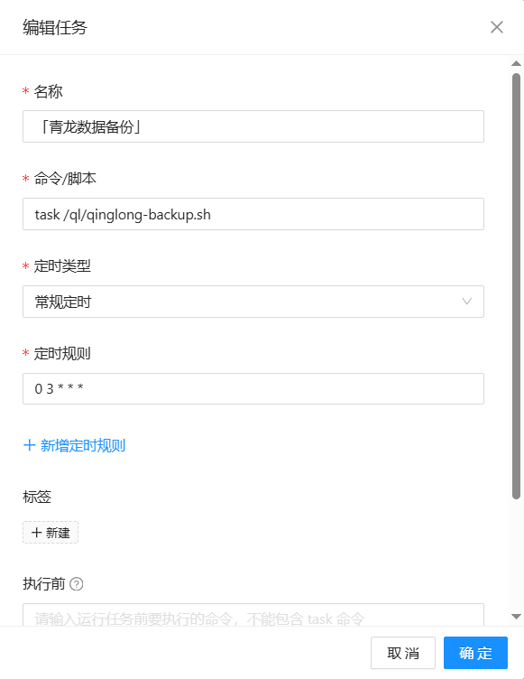

#### 注意 注意 注意：备份和本项目不要放在同一个仓库。
## 必需配置项
| 变量 | 必填 | 默认值 | 说明 |
|------|------|--------|------|
| `GH_BACKUP_REPO` | ✅ | - | GitHub 备份仓库地址 (格式: user/repo) |
| `GH_TOKEN` | ✅ | - | GitHub 访问令牌 |
| `GH_BACKUP_BRANCH` | ✅ | `main` | 备份分支名称 |
| `ADMIN_USERNAME` | ✅ | - | 面板登录用户名 |
| `ADMIN_PASSWORD` | ✅ | - | 面板登录密码 |
| `QL_PORT` | ✅ | `5700` | 服务运行端口 |

## 可选配置项
| 变量 | 必填 | 默认值 | 说明 |
|------|------|--------|------|
| `KEEP_BACKUPS` | ❌ | `5` | 保留的备份数量 |
| `BACKUP_PASS` | ❌ | - | 备份文件加密密码 |
| `DATA_DIR` | ❌ | `/ql/data` | 数据目录路径 |
| `GH_EMAIL` | ❌ | `qinglong@render.com` | Git 提交使用的邮箱 |
| `GH_USER` | ❌ | `QingLong-Backup` | Git 提交使用的用户名 |

## 配置示例

```bash
## 必需环境变量
GH_BACKUP_REPO=your-username/your-repo
GH_TOKEN=ghp_your_github_token
GH_BACKUP_BRANCH=main
ADMIN_USERNAME=admin
ADMIN_PASSWORD=secure_password
QL_PORT=5600

## 可选环境变量
KEEP_BACKUPS=5
BACKUP_PASS=your_encryption_password
DATA_DIR=/ql/data
GH_EMAIL=your-email@example.com
GH_USER=Your-Name
```

## 请在青龙面板中添加定时备份任务: task /ql/qinglong-backup.sh"


